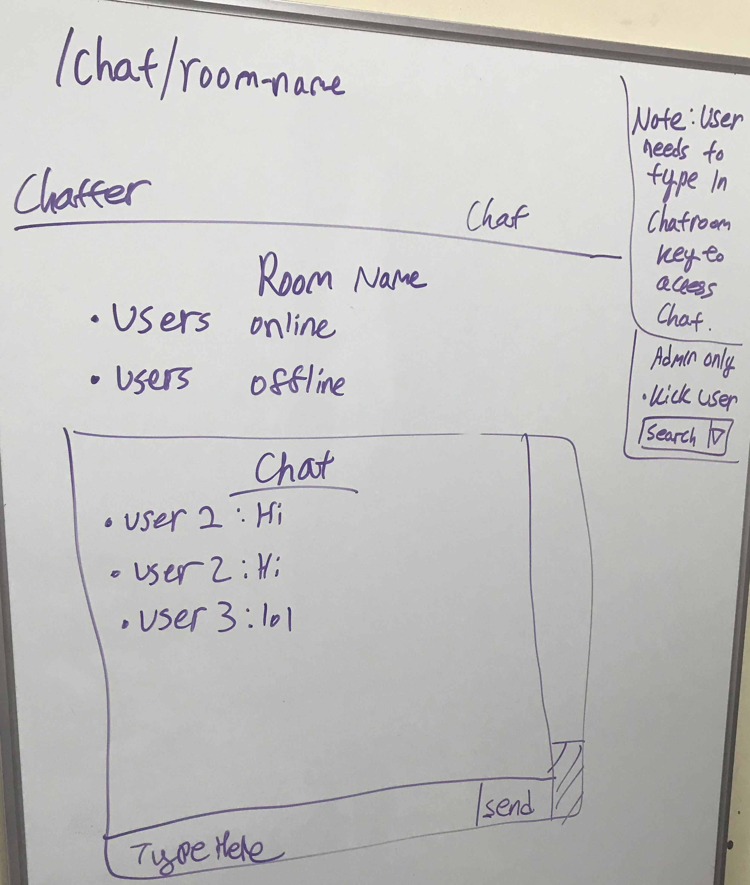

Note: I have created only 1000 admin keys (Admin registration keys can not be created via the site). If you need more, tell me.
Registration can be done without an admin key, but they can not create rooms.

# Chatter

## Overview

Ever wanted a live group chat for the class you are enrolled? Well now there is Chatter. A live chat web application that connects individuals within a class to a chat room. It is like Slacks but for class. Students will enroll in the app and be able to live chat in groups or private chat with someone. There will be multiple session rooms available, allowing for multiple chat sessions at once. Students will also be able to see who is online at the moment in their class. Chatter will require a key to login; this is provided by the instructor (key is generated by Chatter).

## Data Model

The application will store Users, Chat Room, and Private Message

* Users can be in multiple Chat Rooms (By reference).
* Users can be in multiple Private Messages (By reference).
* Every Chatroom will contain a list of username (By Reference).
* Every Private Message will contain 2 username (By Reference).

An Example User:

```javascript
{
  username: String,
  password: String, //Hashed Password,
  chatrooms: [ Number ], //Chat Room IDs
  email: String,
  permission: Number //User's permission level
}
```

An Example Chat Room

```javascript
{
  name: String, //Chat Room name
  id: Number, //Chat Room ID
  users: [ String ] //Array of usernames
  messages: [
    {
    username: String, //User's username
    message: String, //User's message
    time: String //Time that the message was sent
    }
  ]
}
```

An Example Private Message

```javascript
{
  users: [ String ] //Array of usernames
  messages: [
    {
    username: String, //User's username
    message: String, //User's message
    time: Date //Time that the message was sent
    }
  ]
}
```

An Example Key

```javascript
{
  key: String, //An unhashed key used for registration or chatroom access
  type: String, //Type of key. Either login or the chatroom ID
  uses: Number //Number of uses for the key
}
```

## [First Draft Schema](db.js) 

## Wireframes

Home Page - Landing Page


/Keys - Key generator page


/Login - Login page


/Register - Register page


/Users - User search page | Scrapped/Integrated with /Direct


/Direct - Direct Messaging Page with user lookup


/Chat - Chat room lookup along with chat room create/delete


/Chat/Room-Name - The select room's chat


## Site map


## User Stories or Use Cases

1. As a non-registered user, I can register a new account with the site.
2. As an user, I can log in to the site.
3. As an user, I can send/view messages to rooms I have access to.
4. As an user, I can send/view direct messages to other users.
6. As an administrator, I can create keys for users to gain access to rooms.
7. As an administrator, I can create chatrooms.

## [Initial Main Project File](app.js) 

## Annotations / References Used

1. [React/Express Boilerplate](https://github.com/nathandalal/react-express-template.git)
2. [Bootstrap 4 Doc](https://getbootstrap.com/docs/4.0/getting-started/introduction)
3. [Various CSS Magic Tricks 🧙](https://css-tricks.com)


ESLint with node_modules/.bin/eslint */

Plz dont run w/ IE.
